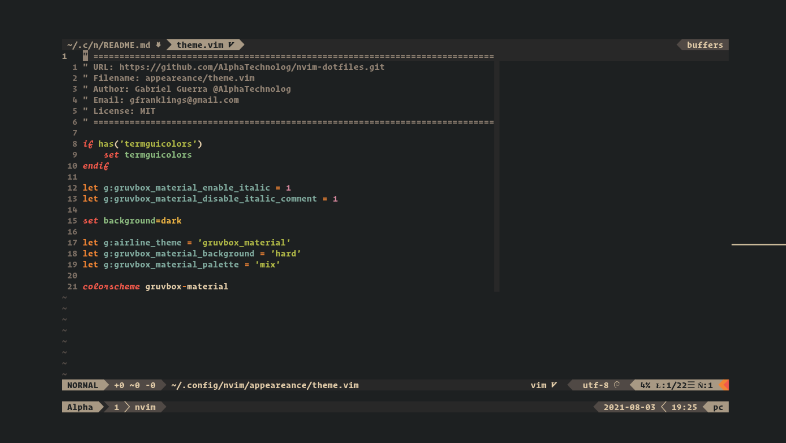
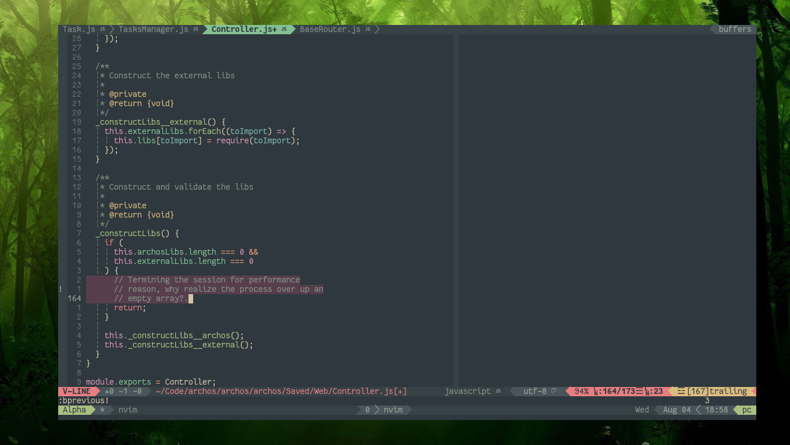

# nvim-dotfiles

This is my nvim-dotfiles.

## Screenshots





> NOTE: The fonts showed in the screenshots are OperatorMono and Fantasque iCursive Op with tmux

## Getting started

First clone this repo, and activate the nvim config:

```sh
mkdir -p ~/repo && cd ~/repo
git clone https://github.com/AlphaTechnolog/nvim-dotfiles.git
if [[ -d $HOME/.config/nvim ]]; then mv $HOME/.config/nvim $HOME/.config/nvim.old; fi
cp -r ./nvim-dotfiles ~/.config/nvim
```

## Installing the plugins

Now open `nvim`:

```sh
nvim
```

And type the command `:PlugInstall`

Restart nvim and the config was applied.

## Features

- Airline - as statusbar
- coc (enable it, see bottom for activate) - for autocomplete
- emmet-vim - for autocomplete
- vim-polyglot - for most syntax highlighting
- nerdtree - files explorer
- vim-devicons - for files icons
- tmuxline - for tmux integration
- vim-closetag - for autotag close in html
- vim-cpp-modern - for cpp syntax highlighting
- vim-cpp-enhanced-highlight - for cpp enhanced syntax highlighting
- indentline - (the name explain the functionality)
- vim-autopairs - for coding autopair
- vim-signify - for git integration
- Colorizer - for hex and css colors highlighting
- vim-manpager - for use vim as man pager

## Enabling coc

To enable coc, first go to the file `plugins/init.vim`, and uncomment
this line: `" Plug 'neoclide/coc.nvim', {'branch': 'release'}` the line
46.

Now go to the file `init.vim`, and uncomment this line: `" source $HOME/.config/nvim/plugins/configs/coc.vim`
the line 31.

Change the settings as you want and enjoy

## Keybindings

- To change to normal mode in insert mode use: jk, kk, kj, jj.
- Use M-hjkl to resize a splited window, and use C-hjkl to change focus to a splited window.
- Use C-s to save the file and C-q to save and exit.
- Use C-b to close a buffer
- Use TAB and S-TAB to navigate between buffers in normal mode

## Selecting a theme

Actually I have two themes configured:

- Gruvbox Material Mix Hard
- Edge Aura
- Edge Light
- Everforest Dark

If you select the main branch you don't have a selected theme,
to switch to gruvbox material mix hard or edge aura, select one of
this branchs:

- gruvbox-mix-hard
- edge
- edge-light
- everforest-dark
